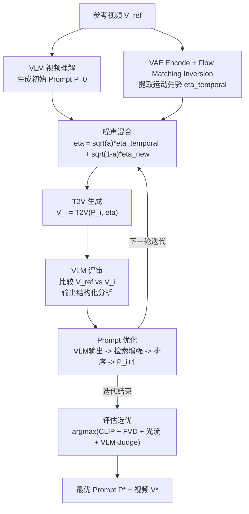

# P-Flow 视频 Prompt 反演与优化 Pipeline —— 完整技术文档

## 一、项目概述

本项目复现论文 "P-Flow: Training-Free Customization of Visual Effects via Flow Matching Inversion" (arXiv:2603.22091)，实现了基于 VLM 反馈的 Test-Time Prompt Optimization 框架。核心思路：VLM 能"看"，T2V 模型能"画"，让 VLM 反复对比"参考视频 vs 生成视频"的差异，自动帮你改 prompt，每轮生成的视频就会更接近参考。Noise Prior 则从噪声空间给一个额外的运动节奏暗示，和 prompt 优化互补。

---

## 二、数据集与模型选型

### 数据集

| 数据集 | 规模 | 用途 | 状态 |
|--------|------|------|------|
| **MovieGenVideoBench (high-motion 200)** | 200 条 | 主评估集（与同门对齐） | ✅ 已筛选 |
| MovieGenVideoBench (全集) | 1003 条 | 完整 benchmark | 已有 CSV |

**数据筛选规则**（与同门 Video2Prompt 项目完全一致）：从 MovieGenVideoBenchWithTag.csv 中筛选 `motion_level=high` 的样本（共 265 条），按 prompt 长度降序排列，取前 200 条。

**数据规范**：480×832，81 帧 @16fps（约 5s），mp4 H.264。

**服务器数据布局**：
```
/root/autodl-tmp/
├── models/
│   ├── Wan2.1-T2V-1.3B-Diffusers/   # T2V 模型
│   ├── clip-vit-base-patch32/         # CLIP 评测模型
│   └── xclip-base-patch32/            # X-CLIP 视频评测模型
├── videofake/                          # 代码仓库
│   ├── P-Flow/                         # 本项目
│   └── Video2Prompt/                   # 同门项目（共享数据）
└── data/                               # 数据集（待建立）
    └── video-200/
        ├── water_mark_out/             # 原始参考视频 ({id}.mp4)
        ├── captions_qwen/             # Qwen VLM caption ({id}.txt)
        └── pflow_output/              # P-Flow 生成结果 ({id}.mp4)

/root/models/
└── Qwen2.5-VL-7B-Instruct/           # VLM 模型（系统盘）
```

### VLM 选型

| 模型 | 角色 | 部署方式 | 状态 |
|------|------|---------|------|
| **Qwen2.5-VL-7B-Instruct** | 主力（迭代 prompt 优化） | 本地 A800，bf16 | ✅ 已部署 |

### T2V 选型

| 模型 | 角色 | 部署方式 | 状态 |
|------|------|---------|------|
| **Wan 2.1-T2V-1.3B** | 主力 | 本地 A800，bfloat16 | ✅ 已部署 |

### 评估指标（与同门对齐）

**集合级指标**（200 条样本整体评估）：

| 指标 | 衡量维度 | 模型/工具 | 状态 |
|------|---------|----------|------|
| CLIP cosine similarity | 帧级语义相似度（原-生/原-文/生-文） | clip-vit-base-patch32 | ✅ 模型就绪 |
| X-CLIP cosine similarity | 视频级语义相似度（同上三组） | xclip-base-patch32 | ✅ 模型就绪 |
| STREAM-T | 时间频域分布距离 | DINOv2 (v-stream) | ⚠️ 需安装 |
| STREAM-F | Precision 型覆盖 | DINOv2 (v-stream) | ⚠️ 需安装 |
| STREAM-D | Recall 型覆盖 | DINOv2 (v-stream) | ⚠️ 需安装 |

**Per-Iteration 指标**（单样本逐轮评估，已有）：

| 指标 | 衡量维度 | 状态 |
|------|---------|------|
| SSIM | 像素级结构相似度 | ✅ 已实现 |
| CLIP-Similarity | 帧级语义相似度 | ✅ 已实现 |
| Motion Magnitude/Direction | 运动模式相关性 | ✅ 已实现 |
| Prompt-Video Alignment | Prompt 与生成视频对齐度 | ✅ 已实现 |

---

## 三、Pipeline 流程与优化点



### 各环节优化点汇总

| 环节 | 优化点 | 方法来源 |
|------|--------|---------|
| **VLM 初始描述** | 多粒度 4 层描述（场景/运动/效果/时序）-> LLM 融合 | 自研 |
| | 多 VLM 集成（Qwen + GPT-4o + Gemini 去重融合） | 自研 |
| | 光流自适应关键帧（运动剧烈处密采样） | 自研 |
| | 内容/运动解耦分支描述 | DisMo (NeurIPS 2025) |
| **Inversion** | RF-Solver 高精度 ODE 求解（误差降 40-60%） | ICML 2025 |
| | Predictor-Corrector 近乎无损反演 | UniEdit-Flow |
| | Midpoint 二阶积分 | P-Flow 已实现 |
| **SVD 滤波** | 基于光流幅度自适应 rho_s/rho_m | 自研 |
| | 多尺度（帧级/片段级/全局级）分别滤波 | 自研 |
| | FFT 频域替代（物理意义更明确） | 自研 |
| | DisMo 运动编码器替代 SVD | NeurIPS 2025 |
| **噪声混合** | 自适应 alpha（前期 0.01 -> 后期 0.0001） | 自研 |
| | 分步注入（不同 timestep 不同强度） | 自研 |
| | Video-MSG 结构化噪声（视频草稿 -> inversion） | arXiv:2504.08641 |
| **T2V 生成** | Prompt 压缩重排（核心前置 <=77 token） | 自研 |
| | RAPO++ 训练数据对齐改写 | CVPR 2025 |
| | Negative Prompt 工程 | 工程经验 |
| **VLM 评审** | 结构化 5 维度量化分析 | P-Flow Listing 1 |
| | 历史摘要避免重复/遗忘 | 自研 |
| | 置信度控制修改幅度 | 自研 |
| | 光流分析结果注入 VLM 上下文 | 自研 |
| **Prompt 优化** | RAG 检索增强对齐训练分布 | RAPO++ (CVPR 2025) |
| | 3R: Retrieval -> Refinement -> Ranking | arXiv:2603.01509 |
| | 并行多候选 + 排序选优 | 自研 |
| | 结构化模板（固定字段，按需修改） | 自研 |
| | MotionPrompt 光流引导 embedding | CVPR 2025 |
| | 树搜索 Beam/MCTS | 自研 |
| | RL/DPO 微调 VLM prompt 策略 | VPO (ICCV 2025) |

---

## 四、算法详细流程（Algorithm 1）

### 阶段一：Noise Prior Enhancement（实验开始前执行一次）

```
参考视频 V_ref
    -> VAE Encode -> 视频潜空间 x_1
    -> Flow Matching Inversion (以 P_0 为条件, 50步) -> 反演噪声 eta_inv
    -> SVD Spatial Filter (自适应能量阈值: 去除顶部分量直至剩余能量>=rho_s)
    -> SVD Temporal Retain (自适应能量阈值: 保留顶部分量直至能量累积>=rho_m)
    -> 得到时序先验 eta_temporal
```

关键细节：

- **Inversion 条件**：以用户 prompt P_0 为条件（非空字符串），确保反演路径与生成路径在同一条件流形上。
- **SVD 自适应阈值**：不是固定截断前 k 个奇异值，而是按能量比例动态确定 k 值。空间阶段找最小 k_s 使去除后剩余能量 >= rho_s * 总能量；时序阶段找最小 k_m 使累积能量 >= rho_m * 总能量。
- **融合时机**：eta_temporal 计算完成后不立即与随机噪声混合，混合步骤延迟到每轮迭代内执行。

SVD 滤波的核心目的：从参考视频中提取"运动骨架"（时序结构），去掉具体的"内容外观"（空间特征），让生成模型在保持类似运动模式的同时自由发挥内容。

### 阶段二：Test-Time Prompt Optimization（迭代循环）

```
每轮迭代开始时:
  - eta_new ~ N(0, I)                                    # 重新采样随机噪声
  - eta = sqrt(alpha) * eta_temporal + sqrt(1-alpha) * eta_new   # 重新融合

输入给 T2V:
  - prompt: 当前迭代的文本提示词 P_i
  - latents: eta (本轮新融合的噪声，每轮不同)
  - 视频规格参数 + guidance_scale + num_inference_steps + generator

T2V 输出 -> 生成视频 V_i

VLM 分析输入（三视频垂直拼接）:
  - 参考视频 V_ref
  - 上一轮生成视频 V_{i-1}
  - 当前生成视频 V_i
  
VLM 结构化输出:
  - reference_description: 参考视频描述
  - last_generated_description: 上轮视频描述
  - new_generated_description: 本轮视频描述
  - comparison: 对比差异分析
  - refined_prompt: 优化后的prompt（供下轮使用）
```

**关键设计：每轮重新采样噪声**。eta_temporal 提供运动结构的"锚点"，而每轮不同的 eta_new 提供探索多样性，使得即使相同 prompt 也能产生略有差异的生成结果，增加找到最优视频的概率。

---

## 五、T5 Text Encoder 分析与 Prompt Token 预算

### 5.1 源码级事实（Wan2.1 官方仓库）

Wan2.1 的文本编码器为 UMT5-XXL（约 4.7B 参数），1.3B 和 14B 共享同一个 T5 模型权重和配置：

```python
# wan/configs/shared_config.py (1.3B / 14B 共用)
wan_shared_cfg.t5_model = 'umt5_xxl'
wan_shared_cfg.t5_dtype = torch.bfloat16
wan_shared_cfg.text_len = 512   # 最大序列长度（token 数，含 special tokens）
```

Tokenizer 截断逻辑将超过 512 tokens 的内容直接丢弃。

### 5.2 实测 Token 数与截断点（tokyo_street_test 10轮实验）

使用 Wan2.1-T2V-1.3B-Diffusers 自带的 T5 Tokenizer（路径：`models/Wan2.1-T2V-1.3B-Diffusers/tokenizer`）对 10 轮实验的 prompt 进行实测：

| Iter | Words | **实测 Tokens** | 被截断? |
|------|-------|----------------|---------|
| 1 | 183 | 263 | No |
| 2 | 211 | 300 | No |
| 3 | 259 | 370 | No |
| 4 | 278 | 400 | No |
| 5 | 326 | 470 | No |
| **6** | **362** | **543** | **YES ← 首次截断** |
| 7 | 388 | 592 | YES |
| 8 | 401 | 626 | YES |
| 9 | 401 | 626 | YES |
| 10 | 439 | 679 | YES |

**关键结论**：

- 实际 token/word 比率约 **1.5x**（mT5 SentencePiece 分词比预期更碎片化）
- **真实截断点为第 6 轮**（362 词 → 543 tokens，超出 512 限制 31 tokens）
- 安全词数上限：**~340 English words**（对应 ~510 tokens，刚好不触发截断）
- 第 8、9 轮词数完全相同（401 词 / 626 tokens），VLM 输出也相同，说明系统已陷入循环——被截断后模型看到的有效内容固定，无论 VLM 如何追加细节都无效
- 从第 6 轮起，prompt 尾部 31-167 个 token 被静默丢弃，后置的细节描述（如"No artistic stylization"等约束指令）完全不生效

### 5.3 "有效利用窗口" vs "理论最大长度"

512 tokens 是理论上限，但实际有效利用率受以下因素约束：

**T5 相对位置编码衰减**：`max_dist=128`，相对距离超过 128 tokens 的 token 对被映射到同一个 bucket，位置区分度退化。

**DiT Cross-Attention 容量差异**：

| 模型 | Attention Heads | Hidden Dim | 实际有效利用 |
|------|----------------|------------|-------------|
| 1.3B | 12 | 1536 | ~150-200 tokens（约100-150 英文词） |
| 14B | 40 | 5120 | ~300-400 tokens（约200-300 英文词） |

14B 模型并非"编码了更长的文本"，而是"同等编码下利用率更高"。

**实验观察**：V1 策略的 prompt 从 183 词增长到 446 词（2.44 倍膨胀）。在 1.3B 模型上，超过 120 词后生成质量不再随 prompt 长度提升而改善，后半段描述基本被忽略。第 6 轮起 prompt 物理截断生效后，系统完全丧失优化能力。

### 5.4 Prompt Token 预算策略（V2 优化）

| 目标模型 | 推荐词数（英文） | 对应 Token 数 | 策略原则 |
|---------|---------------|-------------|---------|
| 1.3B | 80-120 词 | 100-160 tokens | 前 40 词承载核心语义，后半段补充细节 |
| 14B | 150-250 词 | 200-350 tokens | 可容纳更复杂的场景描述 |

V2 结构化模板按信息优先级排序：

```
[SUBJECT -> ACTION -> SCENE -> CAMERA -> STYLE]
 (核心前置)   (运动描述)  (背景补充)  (镜头语言)  (氛围点缀)
 <------ 前 40 词：最高权重 ------>  <-- 后半段：辅助信息 -->
```

**关键原则**：前置最重要的视觉元素。T2V 模型的 cross-attention 对序列前部的 token 有更高的注意力权重。

---

## 六、Prompt 策略 V1 vs V2 对比

### 6.1 V1 问题诊断

| 问题 | 具体表现 | 根因 |
|------|---------|------|
| Prompt 过长 | 7 词 -> 250+ 词（3 轮即膨胀） | 指令未约束输出长度 |
| 叙事式描述 | "First X, then Y, finally Z" | VLM 模仿人类叙事习惯 |
| 元语言干扰 | "ensure", "maintain", "the scene should" | T2V 模型不理解指令性语言 |
| 无结构 | 随机组织，风格/主体/动作混杂 | 未提供模板约束 |
| 无模型认知 | 描述多步因果链 | 不了解 1.3B 只能处理单连续动作 |

### 6.2 V2 核心改动

1. **Token Budget 硬约束**：代码层面 `_enforce_word_limit(prompt, max_words=80)` 截断 + 句末对齐
2. **结构化模板**：SUBJECT->ACTION->SCENE->CAMERA->STYLE 固定顺序
3. **Top-1 差异策略**：每轮只修复最大的一个视觉差异，避免全量重写导致的回退
4. **T2V 能力声明**：在 system prompt 中明确告知 VLM 模型的能力边界
5. **降低温度**：0.7 -> 0.4，减少输出随机性

### 6.3 V2 System Prompt 设计

```text
## CRITICAL: T2V Model Constraints
- Effective token window: ~100-150 English words (前置40词权重最高)
- Cannot follow sequential instructions ("first X, then Y" often fails)
- Responds best to: concrete nouns, vivid action verbs, spatial relationships, lighting
- Responds poorly to: abstract instructions, meta-commentary, quality adjectives
- Single continuous action works best; multi-step narratives collapse

## Prompt Template (MUST follow this order)
[SUBJECT]: who/what, appearance details
[ACTION]: motion/movement, direction
[SCENE]: background, setting, objects
[CAMERA]: shot type, angle, movement
[STYLE]: lighting, color palette, atmosphere
```

---

## 七、评测框架

### 7.1 Per-Iteration 轻量评测指标

`evaluation/eval_reproduction.py` 实现了 4 个互补指标：

| 指标 | 衡量维度 | 范围 | 依赖 |
|------|---------|------|------|
| SSIM | 像素级结构相似度 | 0-1（越高越好） | scikit-image（无需GPU） |
| CLIP-Similarity | 语义特征余弦相似度 | 0-1（越高越好） | CLIP ViT-B/32 |
| Motion Magnitude | 运动幅度相关性 | -1~1（越高越好） | 仅 numpy |
| Motion Direction | 运动方向相似度 | -1~1（越高越好） | 仅 numpy |
| Prompt-Video Alignment | Prompt与生成视频对齐度 | 0-1（越高越好） | CLIP ViT-B/32 |

**诊断矩阵**：

| P-V Align | CLIP-Sim to Ref | 诊断 |
|-----------|-----------------|------|
| 高 | 高 | Prompt 写得好，模型也执行到位 |
| 高 | 低 | Prompt 描述偏了（和生成匹配但和参考不像） |
| 低 | 高 | Prompt 冗余/不精确，但模型凑巧生成了接近参考的内容 |
| 低 | 低 | Prompt 和模型都有问题 |

### 7.2 为什么不用 FID-VID 和 FVD

FID-VID 和 FVD 是分布级指标，要求 2048+ 样本才能统计显著。我们的场景是单视频 3-10 轮迭代，需要的是 per-iteration 逐轮对比指标。

### 7.3 评测输出格式

```json
{
  "summary": {
    "num_iterations": 3,
    "best_ssim_iter": 2,
    "best_ssim": 0.4521,
    "best_clip_iter": 3,
    "best_clip": 0.8234,
    "ssim_trend": "improving",
    "clip_trend": "improving"
  },
  "per_iteration": [
    {
      "iteration": 1,
      "ssim": 0.3892,
      "clip_similarity": 0.7856,
      "motion_magnitude_sim": 0.4231,
      "motion_direction_sim": 0.3102,
      "prompt_video_alignment": 0.2845,
      "prompt_words": 45
    }
  ]
}
```

---

## 八、AutoDL 部署指南

### 8.1 机型配置

| 配置 | 4090 (1.3B 快速验证) | A800 (14B 完整复现) |
|------|---------------------|-------------------|
| GPU | RTX 4090 24GB | A800-80GB |
| 镜像 | PyTorch 2.5.1 / Python 3.12 / CUDA 12.4 | 同左 |
| 数据盘 | 50GB（最低） | 100GB（推荐） |
| 费用 | 有卡 1-2 元/h | 有卡 3-5 元/h |
| 模型 | Wan2.1-T2V-1.3B-Diffusers (~27GB) | Wan2.1-T2V-14B-Diffusers (~55GB) |
| 迭代次数 | 3 轮 | 10 轮（论文原始） |
| 单样本耗时 | ~5-8 min | ~17-22 min |
| 显存占用 | ~8-12 GB | ~40-50 GB |

> **重要**：必须使用 **Diffusers 格式**模型（含 `model_index.json`），原始 checkpoint 格式无法被 `from_pretrained()` 加载。

### 8.2 当前服务器环境（AutoDL A800）

```
服务器: AutoDL A800-80GB
镜像: PyTorch 2.5.1 / Python 3.12 / CUDA 12.4

/root/
├── models/
│   └── Qwen2.5-VL-7B-Instruct/       # VLM (系统盘，持久)
├── autodl-tmp/                         # 数据盘 (关机保留)
│   ├── models/
│   │   ├── Wan2.1-T2V-1.3B-Diffusers/ # T2V 模型 ✅
│   │   ├── clip-vit-base-patch32/      # CLIP ✅
│   │   └── xclip-base-patch32/         # X-CLIP ✅
│   └── videofake/                      # 代码仓库
│       ├── P-Flow/                     # 本项目
│       └── Video2Prompt/               # 同门项目
└── miniconda3/                         # Python 环境
```

### 8.3 环境部署（首次 / 重建）

```bash
# Step 1: 网络加速
source /etc/network_turbo

# Step 2: 克隆代码
cd /root/autodl-tmp
git clone https://github.com/TianwenZhang123/xixihaha.git videofake
cd videofake

# Step 3: 安装依赖
pip install -r P-Flow/requirements.txt -i https://pypi.tuna.tsinghua.edu.cn/simple
pip install v-stream -i https://pypi.tuna.tsinghua.edu.cn/simple  # STREAM 评测
# A800 额外安装: pip install flash-attn --no-build-isolation

# Step 4: 环境变量
export HF_HOME=/root/autodl-tmp/huggingface
echo 'export HF_HOME=/root/autodl-tmp/huggingface' >> ~/.bashrc
source ~/.bashrc

# Step 5: 模型已就绪（无需重新下载）
# /root/autodl-tmp/models/ 下已有:
#   Wan2.1-T2V-1.3B-Diffusers, clip-vit-base-patch32, xclip-base-patch32
# /root/models/ 下已有:
#   Qwen2.5-VL-7B-Instruct

# Step 6: 验证
cd /root/autodl-tmp/videofake
python -c "import torch; print(f'PyTorch: {torch.__version__}, CUDA: {torch.cuda.is_available()}')"
python -c "from diffusers import WanPipeline; print('diffusers OK')"
python -c "from stream import STREAM; print('v-stream OK')"
```

### 8.4 运行实验（有卡模式）

```bash
# 确认环境
nvidia-smi

# ---- A800 + 1.3B + 本地 VLM ----
cd /root/autodl-tmp/videofake/P-Flow

# Mock VLM 快速验证
python run.py \
    --video /path/to/reference.mp4 \
    --prompt "description of the video" \
    --output /root/autodl-tmp/outputs/test_mock \
    --mock_vlm --seed 42

# 完整 10 轮迭代（本地 Qwen2.5-VL-7B）
python run.py \
    --video /path/to/reference.mp4 \
    --auto_prompt \
    --output /root/autodl-tmp/outputs/test_001 \
    --config configs/paper_default.yaml \
    --seed 42

# 批量运行 200 条样本（待实现）
python scripts/run_batch_200.py \
    --data_csv /root/autodl-tmp/videofake/Video2Prompt/MovieGenVideoBenchWithTag.csv \
    --video_dir /root/autodl-tmp/data/video-200/water_mark_out \
    --output_dir /root/autodl-tmp/outputs/batch_200 \
    --seed 42
```

### 8.5 后台运行（防 SSH 断连）

```bash
nohup python run.py --video /path/to/ref.mp4 --auto_prompt \
    --output /root/autodl-tmp/outputs/run_001 --seed 42 \
    > /root/autodl-tmp/outputs/run_log.txt 2>&1 &
tail -f /root/autodl-tmp/outputs/run_log.txt
```

---

## 九、评测命令

### 9.1 Per-Iteration 评测（单样本逐轮）

```bash
cd /root/autodl-tmp/videofake/P-Flow

# 单组评测
python evaluation/eval_reproduction.py \
  --experiment_dir /root/autodl-tmp/outputs/test_001 \
  --clip_model_path /root/autodl-tmp/models/clip-vit-base-patch32 \
  --device cuda --num_frames 16

# 两组对比评测（如 alpha 消融）
python evaluation/eval_reproduction.py \
  --experiment_dir /root/autodl-tmp/outputs/alpha_000 \
  --experiment_dir2 /root/autodl-tmp/outputs/alpha_001 \
  --clip_model_path /root/autodl-tmp/models/clip-vit-base-patch32 \
  --device cuda --num_frames 16
```

### 9.2 集合级评测（200 条批量，与同门对齐）

评测脚本复用同门 Video2Prompt 的实现，确保指标计算方式完全一致：

```bash
cd /root/autodl-tmp/videofake/Video2Prompt/scripts

# CLIP + X-CLIP 评测
python run_clip_vclip_eval.py \
  --orig-dir /root/autodl-tmp/data/video-200/water_mark_out \
  --gen-dir /root/autodl-tmp/outputs/batch_200_final \
  --caption-dir /root/autodl-tmp/data/video-200/captions_qwen \
  --output-dir /root/autodl-tmp/outputs/eval_results/clip_vclip \
  --clip-model /root/autodl-tmp/models/clip-vit-base-patch32 \
  --vclip-model /root/autodl-tmp/models/xclip-base-patch32

# STREAM (T/F/D) 评测
python run_stream_eval.py \
  --orig-dir /root/autodl-tmp/data/video-200/water_mark_out \
  --gen-dir /root/autodl-tmp/outputs/batch_200_final \
  --output-dir /root/autodl-tmp/outputs/eval_results/stream \
  --model dinov2 --num-frames 16
```

### 9.3 评测模型路径

| 模型 | 路径 | 状态 |
|------|------|------|
| CLIP ViT-B/32 | `/root/autodl-tmp/models/clip-vit-base-patch32` | ✅ |
| X-CLIP base-patch32 | `/root/autodl-tmp/models/xclip-base-patch32` | ✅ |
| DINOv2 (STREAM) | torch.hub 自动下载 | ⚠️ 首次需联网 |

---

## 十、实验记录

### 10.1 Spaceman alpha 消融实验（三组对比）

**实验日期**：2026-05-24
**参考视频**：MovieGenBench #2 — 宇航员站在盐滩上，几乎完全静止
**实验目的**：对比不同 alpha 值对视频复现质量的影响（消融 noise prior 强度）

#### 实验配置（三组共用）

| 参数 | 值 |
|------|-----|
| T2V 模型 | Wan2.1-1.3B-Diffusers |
| VLM | qwen-vl-max (DashScope, temperature=0.7) |
| 视频尺寸 | 480x832, 81帧@16fps |
| 生成参数 | CFG=5.0, inference_steps=50 |
| SVD 滤波 | rho_s=0.1, rho_m=0.9 |
| 迭代次数 | 3 (固定) |
| 随机种子 | 42 |

#### 评测结果

**Run1: alpha=0.0（纯随机噪声，无运动先验）**

| Iter | SSIM | CLIP-Sim | Motion-Mag | Motion-Dir | P-V Align | Prompt词数 |
|------|------|----------|------------|------------|-----------|-----------|
| 1 | **0.5732** | 0.8378 | 0.2422 | 0.0023 | **0.3736** | 183 |
| 2 | 0.5209 | 0.8469 | -0.0066 | 0.0000 | 0.3614 | 230 |
| 3 | 0.4893 | **0.8592** | -0.2893 | 0.0028 | 0.3622 | 300 |

**Run2: alpha=0.001（论文推荐值，微弱运动暗示）**

| Iter | SSIM | CLIP-Sim | Motion-Mag | Motion-Dir | P-V Align | Prompt词数 |
|------|------|----------|------------|------------|-----------|-----------|
| 1 | **0.5694** | 0.8579 | -0.3728 | -0.0011 | **0.3996** | 176 |
| 2 | 0.5470 | 0.8545 | -0.2349 | -0.0013 | 0.3477 | 188 |
| 3 | 0.5102 | **0.8747** | -0.3930 | -0.0025 | 0.3474 | 255 |

**Run3: alpha=0.1（过强运动先验）**

| Iter | SSIM | CLIP-Sim | Motion-Mag | Motion-Dir | P-V Align | Prompt词数 |
|------|------|----------|------------|------------|-----------|-----------|
| 1 | **0.3733** | 0.7696 | **0.9514** | **0.6674** | 0.3095 | 189 |
| 2 | 0.3729 | 0.7908 | 0.9627 | 0.6742 | 0.2682 | 209 |
| 3 | 0.3395 | **0.8166** | **0.9718** | 0.6562 | 0.2629 | 263 |

#### 三组综合对比（取各组最佳值）

| 指标 | alpha=0.0 | alpha=0.001 | alpha=0.1 | 最优 |
|------|-----------|-------------|-----------|------|
| Best SSIM | 0.5732 | **0.5694** | 0.3733 | alpha=0.0 (微胜0.001) |
| Best CLIP-Sim | 0.8592 | **0.8747** | 0.8166 | **alpha=0.001** |
| Best P-V Align | 0.3736 | **0.3996** | 0.3095 | **alpha=0.001** |
| Motion Magnitude | 0.2422 | -0.2349 | **0.9514** | alpha=0.1 |
| Motion Direction | 0.0023 | -0.0011 | **0.6674** | alpha=0.1 |

#### 关键发现

1. **alpha=0.001 是综合最优值**：CLIP-Sim 三组最高（0.8747），P-V Alignment 三组最高（0.3996），SSIM 几乎与 alpha=0.0 持平（差距仅 0.7%）。论文选择 alpha=0.001 是正确的。

2. **alpha=0.001 vs alpha=0.0 的差异很小**：在这个近乎静止的场景中，微弱的运动先验（sqrt(0.001)=3.2% 权重）几乎不影响像素质量，但在语义层面（CLIP）和 prompt 对齐度（P-V Align）上有明显提升。这说明即使是极微弱的 noise prior 也能让生成结果"更对味"。

3. **alpha=0.1 运动传递强但像素质量代价太大**：Motion 指标碾压其他两组，但 SSIM 降幅 35%。sqrt(0.1)=31.6% 的运动权重在这个静态场景下过于暴力。

4. **三组都出现 SSIM 递减 + CLIP 递增**：V1 prompt 策略的通病——prompt 从 176-189 词膨胀到 255-300 词，超出 1.3B 模型有效窗口。alpha=0.001 的膨胀最慢（176->255），alpha=0.0 膨胀最快（183->300）。

5. **alpha=0.001 的 P-V Align 衰减最小**：从 0.3996 降到 0.3474（衰减 13%），而 alpha=0.0 从 0.3736 降到 0.3614（3%），alpha=0.1 从 0.3095 降到 0.2629（15%）。alpha=0.001 的初始对齐度最高，说明 VLM 生成的初始 prompt 在 noise prior 微弱引导下能更好地匹配生成结果。

6. **Motion 指标对静态场景不适用**：alpha=0.0 和 alpha=0.001 的 Motion-Mag 都出现负值（-0.37/-0.39），这是因为参考视频本身几乎无运动，帧差分信号接近噪声水平，相关系数无统计意义。只有 alpha=0.1 因注入了强运动噪声后产生了与参考帧差分的正相关。

#### 结论

对于论文的完整复现，**alpha=0.001 是正确的选择**。它在不牺牲像素质量的前提下，提供了最佳的语义对齐。alpha 消融实验的结论与论文 Table 4 一致。下一步应在有明显运动的场景（如 MovieGenBench 中运动丰富的视频）上重复此消融，验证 alpha=0.001 在动态场景下的运动传递效果。

### 10.2 已验证的结论

**1.3B 模型能力边界**：能完成基本场景渲染和单主体动态，无法处理细粒度物种区分和多步因果行为链。3 轮迭代即趋于饱和。

**Noise Prior 效果**：alpha=0.001 下时序先验仅作为"微弱运动暗示"，生成模型保持充分创造自由度。每轮重新采样 eta_new 提供探索多样性。已通过三组消融实验验证为综合最优值。

**性能数据**：单样本 15.9 min（3 轮，1.3B，4090），显存 14.2GB allocated，prompt 从 176 词扩展到 255 词。

---

## 十一、视频时长扩展

### 帧数选择

Wan 2.1 的帧数必须满足 **4n+1 规则**，可选：81、121、161、241 等。

| 帧数 | 时长 | 4090可行性 | 单轮生成 | 全流程(3轮) |
|------|------|-----------|----------|-----------|
| 81 帧 | 5s | 可 (CPU Offload) | ~3.5min | ~15min |
| 161 帧 | 10s | **可** (已验证) | ~11.5min | ~42min |

161 帧已在 4090 + CPU Offload 下成功运行，推翻了之前"需要 32GB+ 显存"的预测。真正的显存瓶颈是模型权重而非 latent 大小。SVD 自适应阈值、噪声融合、VLM 分析在 161 帧下均正常工作，代码无需修改，仅改 `config/default.yaml` 中 `num_frames` 即可。

---

## 十二、输出目录结构

```
/root/autodl-tmp/outputs/test_XXX/
├── reference.mp4                    # 参考视频副本
├── generated_iter_001.mp4           # 第1轮生成
├── generated_iter_002.mp4           # 第2轮生成
├── generated_iter_003.mp4           # 第3轮生成
├── full_trajectory.json             # 完整轨迹
├── prompts_history.json             # Prompt 演化历史
├── composites/                      # VLM 输入的垂直 composite
│   ├── composite_iter_001.mp4
│   └── ...
└── optimization_log/                # 每轮优化日志
    ├── iter_001.json
    └── ...
```

---

## 十三、命令速查

```bash
# 按视频 index 运行
python scripts/run_pflow_paper.py --video_index 23 --seed 42

# 指定视频和 prompt
python scripts/run_pflow_paper.py \
    --reference_video /path/to/video.mp4 \
    --prompt "description" \
    --output_dir /root/autodl-tmp/outputs/my_test --seed 42

# 只跑 Noise Prior
python scripts/run_pflow_paper.py --video_index 23 --noise_prior_only --seed 42

# 修改迭代次数和 alpha
python scripts/run_pflow_paper.py --video_index 23 --i_max 5 --alpha 0.001 --seed 42

# 后台运行
nohup python scripts/run_pflow_paper.py --video_index 23 --seed 42 \
    > /root/autodl-tmp/outputs/run_log.txt 2>&1 &

# A/B 对比（eval_only 模式）
python run_ab_test.py --eval_only \
    --dir_v1 /root/autodl-tmp/outputs/test_v1 \
    --dir_v2 /root/autodl-tmp/outputs/test_v2

# 代码更新
cd /root/autodl-tmp/videofake && source /etc/network_turbo && git pull origin main
```

---

## 十四、常见问题

**Q: `model_index.json` not found**
下载了原始格式模型，需改为 Diffusers 格式：`Wan-AI/Wan2.1-T2V-1.3B-Diffusers`

**Q: 环境变量未生效**
执行 `source ~/.bashrc` 或直接 `export DASHSCOPE_API_KEY="key"`

**Q: 下载中断**
直接重新执行同一命令，huggingface-cli 支持断点续传。

**Q: OOM (A800)**
确认 VAE slicing + tiling 已启用（代码默认开启），如仍 OOM 降低分辨率。

**Q: 关机后数据还在吗**
数据盘 `/root/autodl-tmp/` 关机保留，释放实例才清空。

**Q: HuggingFace 下载慢**
`export HF_ENDPOINT=https://hf-mirror.com`

**Q: NumPy 兼容性错误**
`pip install "numpy<2"`

---

## 十五、与同门项目 (Video2Prompt) 对齐方案

### 15.1 实验对比设计

两个项目的实验形成 **baseline vs. ours** 的对比关系：

| 维度 | Video2Prompt (baseline) | P-Flow (ours) |
|------|------------------------|---------------|
| 方法 | 直接 caption → T2V 生成 | 迭代 prompt 优化 + noise prior |
| 流程 | VLM 看原视频 → 一次性 caption → Wan 生成 | VLM 反复对比 → 逐轮优化 prompt → Wan 生成 |
| 迭代次数 | 1（无迭代） | 10 |
| Noise Prior | 无 | 有（alpha=0.001） |
| 输出 | 每条样本 1 个视频 | 每条样本取最优迭代的 1 个视频 |

论文中的对比表格应为：

```
Method          | CLIP↑  | X-CLIP↑ | STREAM-T↓ | STREAM-F↑ | STREAM-D↑
----------------|--------|---------|-----------|-----------|----------
Direct Caption  | 0.xxx  | 0.xxx   | 0.xxx     | 0.xxx     | 0.xxx
P-Flow (ours)   | 0.xxx  | 0.xxx   | 0.xxx     | 0.xxx     | 0.xxx
```

### 15.2 GAP 清单与修改计划

#### GAP-1: 数据集准备（缺少原始视频）

**现状**：同门的 `video-200/water_mark_out/` 目录存放了 200 条原始参考视频（{id}.mp4），但这些视频文件未在 git 仓库中（太大）。P-Flow 需要这些视频作为输入。

**行动**：
- [ ] 从同门处获取 200 条原始视频，放到 `/root/autodl-tmp/data/video-200/water_mark_out/`
- [ ] 或从 MovieGenVideoBench 官方下载后按 `selected_200.csv` 筛选
- [ ] 确认视频格式：mp4, 各种原始分辨率（评测时统一采样帧数即可）

#### GAP-2: Caption 数据复用

**现状**：同门已用 Qwen2.5-VL-7B 对 200 条原视频生成了 caption（`video-200/captions_qwen/{id}.txt`），这些 caption 既是 baseline 的生成输入，也是评测时的"文本"参照。

**行动**：
- [ ] 将同门的 `captions_qwen/` 目录软链接或复制到 P-Flow 可访问的路径
- [ ] P-Flow 的 `--auto_prompt` 模式会自己用 VLM 生成初始 prompt，但评测时需要用同门的 caption 作为统一的文本参照（计算 text-video similarity）

#### GAP-3: 批量运行脚本

**现状**：P-Flow 的 `run.py` 只支持单条视频输入，无法批量跑 200 条。

**行动**：
- [ ] 新建 `P-Flow/scripts/run_batch_200.py`
- [ ] 逻辑：读取 `selected_200.csv` → 遍历每条样本 → 调用 pipeline → 取最优迭代视频 → 输出到统一目录
- [ ] 输出格式：`/root/autodl-tmp/outputs/batch_200_final/{id}.mp4`（与同门的 `wan_out_last100/{id}.mp4` 对齐）

#### GAP-4: 生成参数统一

**现状**：

| 参数 | Video2Prompt | P-Flow | 差异 |
|------|-------------|--------|------|
| steps | 30 | 50 | ⚠️ 不一致 |
| guidance_scale | 5.0 | 5.0 | ✅ |
| height×width | 480×832 | 480×832 | ✅ |
| num_frames | 81 | 81 | ✅ |
| fps | 15 | 16 | ⚠️ 微小差异 |
| seed | 42 + sample_id | 42 | ⚠️ 不一致 |
| negative_prompt | 相同长文本 | 相同长文本 | ✅ |

**行动**：
- [ ] 决定统一 steps：建议都用 50（质量更好），或在论文中注明差异
- [ ] fps 差异影响极小（15 vs 16），可忽略或统一为 16
- [ ] seed 策略：P-Flow 批量运行时也用 `seed = 42 + sample_id` 保持可复现

#### GAP-5: 评测脚本集成

**现状**：P-Flow 的评测（`evaluation/`）只有 per-iteration 指标（SSIM/CLIP/Motion），缺少集合级指标（CLIP/X-CLIP/STREAM）。

**行动**：
- [ ] 安装 `v-stream`：`pip install v-stream`
- [ ] 集合级评测直接调用同门的脚本（路径已在 9.2 节说明）
- [ ] 或将同门的评测逻辑封装到 `P-Flow/evaluation/eval_batch.py` 中

#### GAP-6: 最优迭代选择策略

**现状**：P-Flow 跑 10 轮迭代，需要从中选出"最优"的一轮作为最终输出参与集合级评测。

**行动**：
- [ ] 策略选项：(a) 取最后一轮 (b) 取 CLIP-Sim 最高的一轮 (c) 取 SSIM 最高的一轮
- [ ] 建议：取 CLIP-Sim 最高的一轮（与评测指标一致）
- [ ] 在 `run_batch_200.py` 中实现自动选优逻辑

### 15.3 执行优先级

```
P0 (必须先做):
  1. 获取 200 条原始视频 → 放到服务器
  2. pip install v-stream
  3. 写 run_batch_200.py

P1 (跑实验前):
  4. 统一生成参数 (steps/seed)
  5. 确认 caption 数据路径

P2 (跑完实验后):
  6. 运行集合级评测
  7. 整理对比表格
```

---

## 十六、参考文献

1. P-Flow: Prompting Visual Effects Generation. arXiv:2603.22091
2. Reverse Prompt Engineering. github.com/cyprivlab/reverse-prompt-engineering
3. RAPO++: Cross-Stage Prompt Optimization for T2V. CVPR 2025
4. MotionPrompt: Optical-Flow Guided Prompt Optimization. CVPR 2025
5. 3R: RAG-based Prompt Optimization. arXiv:2603.01509
6. VPO: Video Prompt Optimization. ICCV 2025
7. Video-MSG: Training-free Guidance via Multimodal Planning. arXiv:2504.08641
8. RF-Solver: Taming Rectified Flow for Inversion and Editing. ICML 2025
9. UniEdit-Flow. arXiv:2504.13109
10. DisMo: Disentangled Motion Representation. NeurIPS 2025
11. Qwen2.5-VL. arXiv:2502.13923
12. Wan 2.1. Alibaba
