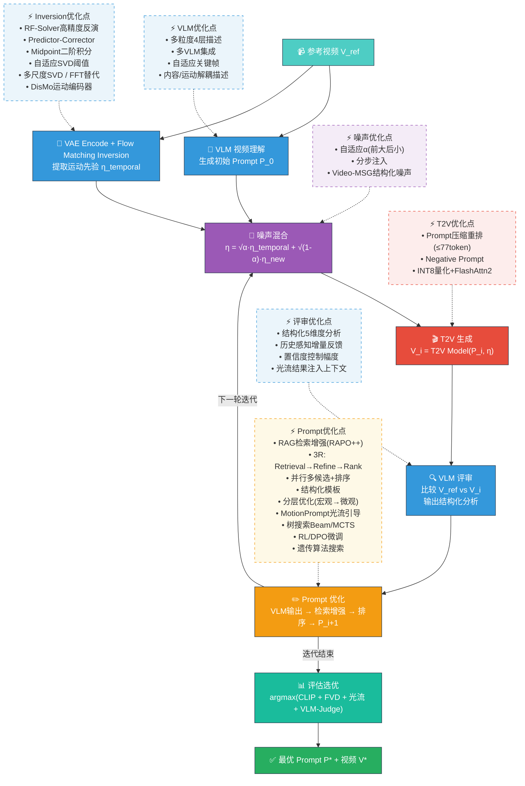

# 视频 Prompt 反演与优化 Pipeline

## 一、数据集与模型选型

### 数据集

| 数据集 | 规模 | 用途 |
|--------|------|------|
| Open-VFX | 15 类视觉特效 | 主评估集 |
| MovieGenBench | 1003 样本 | 通用视频质量评估 |
| VidProM | 180K video-prompt 对 | Prompt 反演评估 + RAG 检索库 |

数据规范：480×832，81 帧 @16fps，mp4 H.264，归一化到 [-1, 1]。

### VLM 选型

| 模型 | 角色 | 理由 |
|------|------|------|
| **Qwen2.5-VL-72B** | 主力 | 视频理解≈GPT-4o，绝对时间编码，国内稳定 |
| GPT-4o | 交叉验证 | 排除系统性偏差 |
| InternVL3-78B | 本地批量 | 开源可部署 |

### T2V 选型

| 模型 | 角色 | 理由 |
|------|------|------|
| **Wan 2.1-14B** | 主力 | P-Flow 原始实现，Flow Matching 架构适配 Inversion |
| Wan 2.1-1.3B | 快速验证 | 单 4090 可跑 |
| CogVideoX-5B / HunyuanVideo | 对比 | 验证模型无关性 |

### 评估指标

CLIP-Score（语义一致性）、FVD（分布距离）、光流一致性（运动保真度）、帧间 SSIM 方差（时序连贯性）、VBench（综合）、VLM-as-Judge（5 维度 1-5 分）。

---

## 二、Pipeline 流程与优化点



### 各环节优化点汇总

| 环节 | 优化点 | 方法来源 |
|------|--------|---------|
| **VLM 初始描述** | 多粒度 4 层描述（场景/运动/效果/时序）→ LLM 融合 | 自研 |
| | 多 VLM 集成（Qwen + GPT-4o + Gemini 去重融合） | 自研 |
| | 光流自适应关键帧（运动剧烈处密采样） | 自研 |
| | 内容/运动解耦分支描述 | DisMo (NeurIPS 2025) |
| **Inversion** | RF-Solver 高精度 ODE 求解（误差降 40-60%） | ICML 2025 |
| | Predictor-Corrector 近乎无损反演 | UniEdit-Flow |
| | Midpoint 二阶积分 | P-Flow 已实现 |
| **SVD 滤波** | 基于光流幅度自适应 ρ_s/ρ_m | 自研 |
| | 多尺度（帧级/片段级/全局级）分别滤波 | 自研 |
| | FFT 频域替代（物理意义更明确） | 自研 |
| | DisMo 运动编码器替代 SVD | NeurIPS 2025 |
| | 比特率控制解耦 | ICCV 2025 |
| **噪声混合** | 自适应 α（前期 0.01 → 后期 0.0001） | 自研 |
| | 分步注入（不同 timestep 不同强度） | 自研 |
| | Video-MSG 结构化噪声（视频草稿 → inversion） | arXiv:2504.08641 |
| | FlowEdit 无反演路径 | FlowEdit |
| **T2V 生成** | Prompt 压缩重排（核心前置 ≤77 token） | 自研 |
| | RAPO++ 训练数据对齐改写 | CVPR 2025 |
| | Negative Prompt 工程 | 工程经验 |
| **VLM 评审** | 结构化 5 维度量化分析 | P-Flow Listing 1 |
| | 历史摘要避免重复/遗忘 | 自研 |
| | 置信度控制修改幅度 | 自研 |
| | 光流分析结果注入 VLM 上下文 | 自研 |
| **Prompt 优化** | RAG 检索增强对齐训练分布 | RAPO++ (CVPR 2025) |
| | 3R: Retrieval → Refinement → Ranking | arXiv:2603.01509 |
| | 并行多候选 + 排序选优 | 自研 |
| | 结构化模板（固定字段，按需修改） | 自研 |
| | 分层优化（宏观→微观） | 自研 |
| | MotionPrompt 光流引导 embedding | CVPR 2025 |
| | 树搜索 Beam/MCTS | 自研 |
| | RL/DPO 微调 VLM prompt 策略 | VPO (ICCV 2025) |
| | 遗传算法搜索 | 自研 |

---

## 三、已验证内容

### 3.1 已跑通的 Baseline 流程

基于 P-Flow 代码 + Wan 2.1-1.3B 模型，已完整跑通以下流程：

```
V_ref → VAE Encode → Flow Matching Inversion (Euler, 50步)
     → SVD 空间滤波 (ρ_s=0.1) → SVD 时序保留 (ρ_m=0.9) → η_temporal
     → 10轮迭代: 噪声混合(α=0.001) → T2V生成 → VLM评审(Qwen-VL-Max) → Prompt更新
     → 离线评估选优
```

### 3.2 已验证的参数配置

```yaml
generation: {height: 480, width: 832, frames: 81, fps: 16, cfg: 5.0, steps: 50}
inversion: {steps: 50, cfg: 1.0, solver: euler}
svd: {rho_s: 0.1, rho_m: 0.9}
noise_blend: {alpha: 0.001}
iteration: {i_max: 10, no_early_stop: true}
hardware: {gpu: A800-80GB (14B) / RTX4090 (1.3B), vlm: DashScope API}
```

### 3.3 已验证的实验结论

**1.3B 模型能力边界**：能完成基本场景渲染和单主体动态，无法处理细粒度物种区分和多步因果行为链。3 轮迭代即趋于饱和。

**VLM 行为观察**：
- 参考视频理解随迭代逐步加深（递进式分析）
- 能一致识别核心缺陷并持续追踪（跨迭代一致性）
- comparison 字段展示递进式思维（增量反馈）

**Noise Prior 效果**：α=0.001 下时序先验仅作为"微弱运动暗示"，生成模型保持充分创造自由度。每轮重新采样 η_new 提供探索多样性。

**性能数据**：单样本 17-22 min（10 轮，14B），显存 40-50 GB，prompt 从 7-50 词扩展到 150-250 词。

### 3.4 已确认的方法论互补关系

| | P-Flow (Baseline) | Reverse Prompt Engineering |
|---|---|---|
| 目标 | 视觉效果迁移 | Prompt 精确恢复 |
| 训练 | 否 (Training-Free) | 是 (RL Fine-tune) |
| 噪声先验 | 有 | 无 |
| 迭代 | 10 轮 VLM-guided | 单次推理 |
| 融合方式 | RPE Phase 1 作为 P_0 生成器 → P-Flow 迭代优化 |

---

## 四、T5 Text Encoder 分析与 Prompt Token 预算

### 4.1 源码级事实（Wan2.1 官方仓库 2025-07）

Wan2.1 的文本编码器为 UMT5-XXL（约 4.7B 参数），1.3B 和 14B 共享同一个 T5 模型权重和配置：

```python
# wan/configs/shared_config.py (1.3B / 14B 共用)
wan_shared_cfg.t5_model = 'umt5_xxl'
wan_shared_cfg.t5_dtype = torch.bfloat16
wan_shared_cfg.text_len = 512   # 最大序列长度（token 数，含 special tokens）
```

`wan_t2v_1_3B.py` 和 `wan_t2v_14B.py` 均继承 `shared_config`，**未覆盖 `text_len`**。

Tokenizer 的截断逻辑：

```python
# wan/modules/tokenizers.py
_kwargs.update({
    'padding': 'max_length',
    'truncation': True,
    'max_length': self.seq_len  # = config.text_len = 512
})
```

结论：T5 encoder 的硬截断点为 **512 tokens**，超过此长度的内容被直接丢弃。

### 4.2 "有效利用窗口" vs "理论最大长度"

512 tokens 是理论上限，但实际有效利用率受以下因素约束：

**（1）T5 相对位置编码衰减**

Wan2.1 T5 使用 `T5RelativeEmbedding`，关键参数 `max_dist=128`。相对距离超过 128 tokens 的 token 对被映射到同一个 bucket，位置区分度退化。这意味着第 128 token 之后，模型对"哪个词在哪个位置"的感知变弱（但语义本身仍然编码）。

**（2）DiT Cross-Attention 容量差异**

| 模型 | Attention Heads | Hidden Dim | Cross-Attn 容量 | 实际有效利用 |
|------|----------------|------------|----------------|-------------|
| 1.3B | 12 | 1536 | 基准 | ~150-200 tokens（≈100-150 英文词） |
| 14B | 40 | 5120 | ~3.4× 基准 | ~300-400 tokens（≈200-300 英文词） |

14B 模型的 DiT 有更多 attention heads 和更高维度，能从同样长度的 T5 输出中提取更多信息。因此 14B 并非"编码了更长的文本"，而是"同等编码下利用率更高"。

**（3）实验观察**

从我们 test_022 的迭代日志看，V1 策略的 prompt 从 7 词增长到 250+ 词（约 300+ tokens）。在 1.3B 模型上，超过 120 词后生成质量不再随 prompt 长度提升而改善，后半段描述基本被忽略。

### 4.3 Prompt Token 预算策略（V2 优化）

基于上述分析，V2 策略的 token 预算设计：

| 目标模型 | 推荐词数（英文） | 对应 Token 数 | 策略原则 |
|---------|---------------|-------------|---------|
| 1.3B | 80-120 词 | 100-160 tokens | 前 40 词承载核心语义，后半段补充细节 |
| 14B | 150-250 词 | 200-350 tokens | 可容纳更复杂的场景描述 |

V2 结构化模板按信息优先级排序：

```
[SUBJECT → ACTION → SCENE → CAMERA → STYLE]
 (核心前置)   (运动描述)  (背景补充)  (镜头语言)  (氛围点缀)
 ←────── 前 40 词：最高权重 ──────→  ←── 后半段：辅助信息 ──→
```

**关键原则**：前置最重要的视觉元素。T2V 模型的 cross-attention 对序列前部的 token 有更高的注意力权重（因为 denoising 每步都做 cross-attn，前部 token 被反复 attend 到的概率更高）。

---

## 五、Prompt 策略 V1 vs V2 对比

### 5.1 V1 问题诊断

| 问题 | 具体表现 | 根因 |
|------|---------|------|
| Prompt 过长 | 7 词 → 250+ 词（3 轮即膨胀） | 指令未约束输出长度 |
| 叙事式描述 | "First X, then Y, finally Z" | VLM 模仿人类叙事习惯 |
| 元语言干扰 | "ensure", "maintain", "the scene should" | T2V 模型不理解指令性语言 |
| 无结构 | 随机组织，风格/主体/动作混杂 | 未提供模板约束 |
| 无模型认知 | 描述多步因果链 | 不了解 1.3B 只能处理单连续动作 |

### 5.2 V2 核心改动

1. **Token Budget 硬约束**：代码层面 `_enforce_word_limit(prompt, max_words=80)` 截断 + 句末对齐
2. **结构化模板**：SUBJECT→ACTION→SCENE→CAMERA→STYLE 固定顺序
3. **Top-1 差异策略**：每轮只修复最大的一个视觉差异，避免全量重写导致的回退
4. **T2V 能力声明**：在 system prompt 中明确告知 VLM 模型的能力边界
5. **降低温度**：0.7 → 0.4，减少输出随机性

### 5.3 V2 System Prompt 设计

```text
## CRITICAL: T2V Model Constraints
- Effective token window: ~100-150 English words (前置40词权重最高)
- Cannot follow sequential instructions ("first X, then Y" often fails)
- Responds best to: concrete nouns, vivid action verbs, spatial relationships, lighting
- Responds poorly to: abstract instructions, meta-commentary, quality adjectives
- Single continuous action works best; multi-step narratives collapse

## Prompt Template (MUST follow this order)
[SUBJECT]: who/what, appearance details
[ACTION]: motion/movement, direction
[SCENE]: background, setting, objects
[CAMERA]: shot type, angle, movement
[STYLE]: lighting, color palette, atmosphere
```

---

## 六、评测框架

### 6.1 为什么不用 FID-VID 和 FVD

FID-VID（Frechet Inception Distance）和 FVD（Frechet Video Distance）都是**分布级指标**（distributional metrics），设计初衷是衡量"生成分布与真实分布的距离"，要求：

- 大样本量（通常需要 2048+ 个样本才能得到统计显著的结果）
- 参考集是一个分布（大量真实视频），而非单个视频
- 使用预训练 I3D 提取特征后，拟合多元高斯分布，计算两个高斯之间的 Frechet 距离

在我们的场景中：

| 问题 | 原因 |
|------|------|
| 样本量不足 | 单视频 3-10 轮迭代 = 只有 3-10 个样本，远不足以拟合分布 |
| 语义错配 | FVD 衡量的是"这批生成视频像不像真实视频分布"，不是"这个视频像不像那个参考视频" |
| 粒度太粗 | 无法回答"第 3 轮比第 2 轮好了多少" |
| 计算昂贵 | 需要 I3D 模型前向传播大量样本 |

我们需要的是**单样本、逐轮对比**的指标："第 i 轮的生成结果，在哪些维度上比第 i-1 轮更接近参考视频？"

### 6.2 Per-Iteration 轻量评测指标

`evaluation/eval_reproduction.py` 实现了 4 个互补指标，覆盖像素/语义/运动/Prompt 四个维度：

#### 指标 1：SSIM（结构相似度）

```
衡量维度：像素级结构相似性
计算方式：逐帧对比参考帧与生成帧的亮度、对比度、结构
数值范围：0-1（越高越好）
依赖包：scikit-image（pip install scikit-image，~2MB，无需 GPU）
```

代码逻辑：从参考视频和生成视频各均匀采样 16 帧 → 逐帧计算 `structural_similarity()` → 取平均值。当 `scikit-image` 不可用时，自动 fallback 到归一化互相关。

**适用判断**：SSIM 高 = 颜色/布局/纹理接近参考。对全局色调和构图变化敏感，对细微语义差异不敏感。

#### 指标 2：CLIP-Similarity（语义相似度）

```
衡量维度：高层语义特征的接近程度
计算方式：CLIP ViT-B/32 提取参考帧和生成帧的图像特征，计算余弦相似度
数值范围：0-1（越高越好，通常 0.7-0.95 区间有意义）
依赖包：openai-clip（pip install clip）或 transformers
模型下载：ViT-B/32 权重 ~350MB，首次运行自动下载
```

代码逻辑：均匀采样 8 帧 → 每帧分别通过 CLIP 图像编码器 → 参考帧特征与生成帧特征做余弦相似度 → 取平均。支持 OpenAI CLIP 和 HuggingFace 两种后端，自动回退。

**适用判断**：CLIP-Sim 高 = "看起来是同一类场景"。即使像素完全不同但语义相同（如不同角度的同一物体），CLIP-Sim 也会高。

#### 指标 3：Motion Consistency（运动一致性）

```
衡量维度：运动幅度和方向的匹配程度
计算方式：逐帧差分作为运动代理，比较运动量曲线的相关性 + 运动方向的空间余弦相似度
数值范围：-1 到 1（越高越好）
依赖包：仅 numpy（零额外依赖）
```

代码逻辑：

- **Motion Magnitude Sim**：将视频转灰度 → 计算相邻帧差分的平均绝对值（每帧一个标量 = "这帧运动了多少"）→ 得到参考视频和生成视频的运动量时间序列 → 计算 Pearson 相关系数。高相关 = 两个视频"动的节奏"一致。
- **Motion Direction Sim**：每帧差分图展平为向量 → 参考帧和生成帧对应向量做余弦相似度 → 取平均。高值 = 两个视频"动的方向"一致（比如都是从左到右）。

**适用判断**：这是唯一直接衡量"运动是否被正确复现"的指标。像素可能完全不同（不同配色方案），但如果运动模式相同，Motion Consistency 会高。

#### 指标 4：Prompt-Video Alignment（文本-视频对齐度）

```
衡量维度：当前 prompt 对当前生成视频的描述准确度
计算方式：CLIP text encoder 编码 prompt + CLIP image encoder 编码生成帧 → 余弦相似度
数值范围：0-1（越高越好，通常 0.2-0.35 区间）
依赖包：同 CLIP-Similarity（复用同一个模型）
```

代码逻辑：采样 4 帧 → CLIP 文本编码器编码当前 prompt → CLIP 图像编码器编码每帧 → 计算文本-图像余弦相似度 → 取平均。

**诊断价值**：

| Prompt-Video Align | CLIP-Sim to Ref | 诊断 |
|-------------------|-----------------|------|
| 高 | 高 | Prompt 写得好，模型也执行到位 |
| 高 | 低 | Prompt 描述偏了（和生成匹配但和参考不像） |
| 低 | 高 | Prompt 冗余/不精确，但模型凑巧生成了接近参考的内容 |
| 低 | 低 | Prompt 和模型都有问题 |

### 6.3 依赖与安装

```bash
# 核心依赖（评测最小集）
pip install numpy scikit-image tqdm

# CLIP 相关（CLIP-Similarity + Prompt-Video Alignment 需要）
pip install git+https://github.com/openai/CLIP.git  # OpenAI CLIP
# 或者使用 HuggingFace 版本：
pip install transformers torch

# 视频读取（二选一）
pip install decord      # 推荐，高性能
pip install imageio[pyav]  # 备选
```

模型下载说明：

- CLIP ViT-B/32：约 350MB，首次运行自动从 OpenAI CDN 下载
- 若网络受限，可提前下载到 `~/.cache/clip/` 目录
- 如果 CLIP 不可用，SSIM 和 Motion Consistency 仍可正常运行（这两个指标零模型依赖）

### 6.4 A/B 对比实验流程

`run_ab_test.py` 将 V1 和 V2 策略串联为完整对比实验：

```
Phase 1: 加载参考视频 → V1 VLM Client → i_max 轮迭代 → 保存到 v1_output/
Phase 2: 加载同一参考视频 → V2 VLM Client → 同参数(seed/alpha/i_max) → 保存到 v2_output/
Phase 3: compare_experiments(v1_output, v2_output) → 逐指标对比 → 输出 winner
```

关键设计：

- **控制变量**：同一 seed、同一 alpha、同一参考视频，唯一变量是 VLM prompt 策略
- **自动评测**：Phase 3 自动调用 `eval_reproduction.py` 的 `compare_experiments()` 函数
- **eval_only 模式**：已跑完的实验可直接 `--eval_only --dir_v1 xxx --dir_v2 yyy` 只做评测

使用示例：

```bash
# 完整 A/B 实验（需要 T2V 模型 + VLM API）
python run_ab_test.py --video /path/to/ref.mp4 --alpha 0.001 --i_max 5 --seed 42

# 仅评测已有结果
python run_ab_test.py --eval_only \
    --dir_v1 /root/autodl-tmp/outputs/test_022_v1 \
    --dir_v2 /root/autodl-tmp/outputs/test_022_v2
```

### 6.5 快速评测脚本

`scripts/eval_existing.sh` 对已有实验结果（如 test_022）直接跑评测，不需要重新生成：

```bash
#!/bin/bash
cd /root/autodl-tmp/P-Flow
python evaluation/eval_reproduction.py \
    --experiment_dir /root/autodl-tmp/outputs/test_022 \
    --device cuda --num_frames 16
```

前提条件：实验目录需包含 `reference.mp4` 和 `generated_iter_*.mp4` 文件。评测完成后输出 `reproduction_eval.json`，包含逐轮指标和趋势判定。

### 6.6 评测输出格式

```json
{
  "summary": {
    "num_iterations": 3,
    "best_ssim_iter": 2,
    "best_ssim": 0.4521,
    "best_clip_iter": 3,
    "best_clip": 0.8234,
    "ssim_trend": "improving",
    "clip_trend": "improving"
  },
  "per_iteration": [
    {
      "iteration": 1,
      "ssim": 0.3892,
      "clip_similarity": 0.7856,
      "motion_magnitude_sim": 0.4231,
      "motion_direction_sim": 0.3102,
      "prompt_video_alignment": 0.2845,
      "prompt_words": 45
    }
  ]
}
```

---

## 参考文献

1. P-Flow: Prompting Visual Effects Generation. arXiv:2603.22091
2. Reverse Prompt Engineering. github.com/cyprivlab/reverse-prompt-engineering
3. RAPO++: Cross-Stage Prompt Optimization for T2V. CVPR 2025
4. MotionPrompt: Optical-Flow Guided Prompt Optimization. CVPR 2025
5. 3R: RAG-based Prompt Optimization. arXiv:2603.01509
6. VPO: Video Prompt Optimization. ICCV 2025
7. Video-MSG: Training-free Guidance via Multimodal Planning. arXiv:2504.08641
8. RF-Solver: Taming Rectified Flow for Inversion and Editing. ICML 2025
9. UniEdit-Flow. arXiv:2504.13109
10. DisMo: Disentangled Motion Representation. NeurIPS 2025
11. Bitrate-Controlled Diffusion. ICCV 2025
12. Motion-Textual Inversion. Disney Research
13. Qwen2.5-VL. arXiv:2502.13923
14. Wan 2.1. Alibaba
15. VBench
